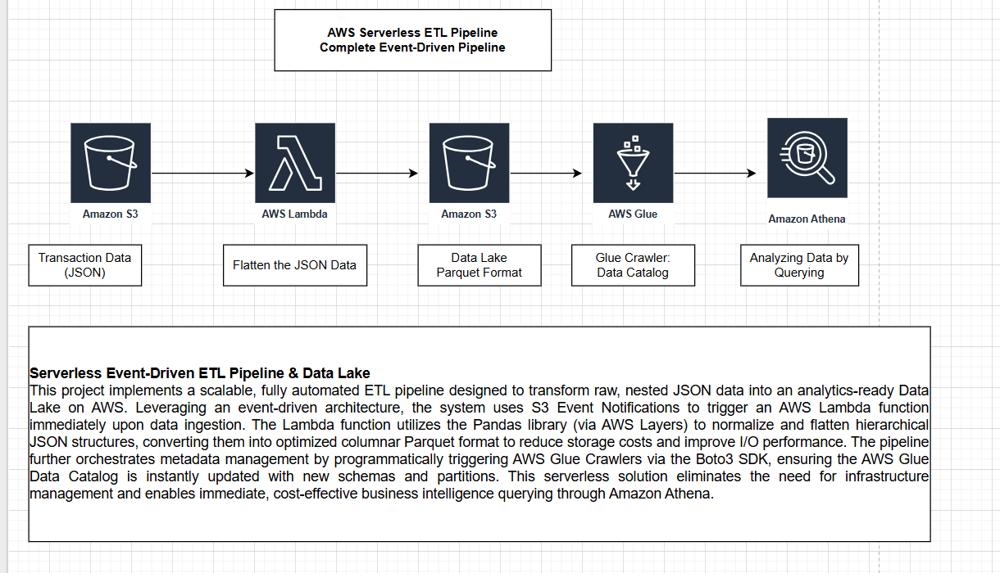
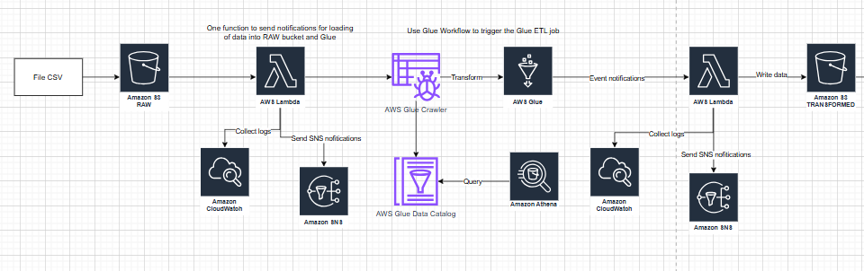

# AWS Serverless Event-Driven ETL Pipeline

## Project Overview

This project implements a scalable, fully automated ETL pipeline designed to transform raw, nested JSON data into an analytics-ready Data Lake on AWS.

## Architecture

Key Services: S3, Lambda, Glue, Athena, Python (Pandas), IAM, Cloudwatch

1.  Ingest:Raw JSON transaction data is uploaded to an Amazon S3 bucket.
2.  Trigger: An S3 Event Notification immediately triggers an AWS Lambda function.
3.  Process:The Lambda function (using the Pandas library via AWS Layers) creates a DataFrame, flattens the nested JSON structure, and converts the data into Parquet format.
4.  Store:The optimized Parquet files are stored in a target S3 bucket (Data Lake).
5.  Catalog: AWS Glue Crawlers are programmatically triggered to update the Data Catalog with new schemas and partitions.
6.  Analyze: Data is immediately available for querying via Amazon Athena.

## Project 2

# Serverless Event-Driven ETL Pipeline on AWS

## Project Overview

This project implements a comprehensive, fully automated data engineering pipeline designed to ingest, process, and analyze data in real-time without managing infrastructure. It leverages an event-driven architecture to transform raw data into an optimized Data Lake for immediate business intelligence and analytics.

## Key Implementation Details

Architected a fully automated serverless ETL pipelineusing AWS S3, Lambda, and Glue to ingest raw data, execute transformations (cleaning, formatting, Parquet conversion), and automate metadata cataloging via Glue Crawlers triggered by real-time S3 events.

Implemented robust orchestration and monitoring by integrating Amazon Athena for automated querying, configuring Amazon SNS and EventBridge for real-time status alerts (success/failure), and leveraging CloudWatch logs to ensure pipeline reliability and performance.

## Technologies Used

Cloud Services: AWS S3, AWS Lambda, AWS Glue (Crawlers & ETL), Amazon Athena, Amazon SNS, Amazon EventBridge, Amazon CloudWatch.
Languages & Formats: Python (Boto3, Pandas), SQL, Parquet, JSON.
